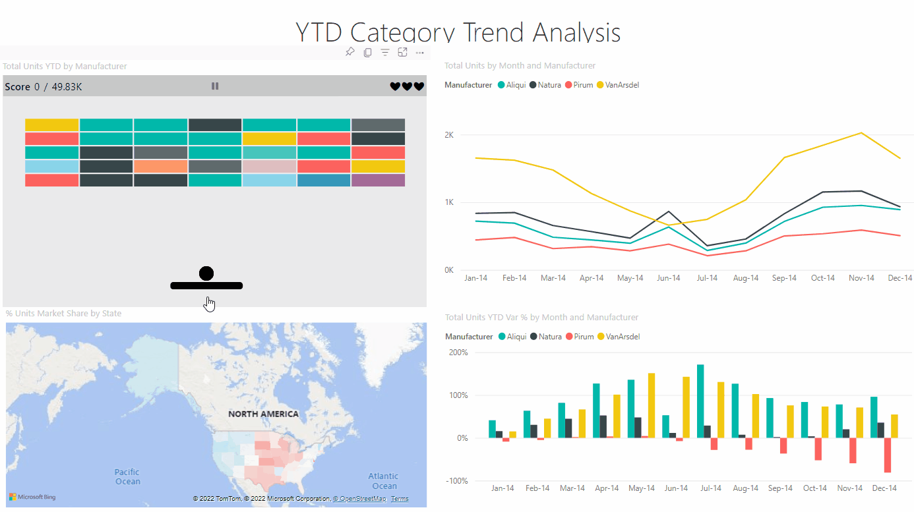

# Power BI Hackathon Data Smash

Developed By: Neil Barkhina, James Lin, Michael Faber and Celia Bayliss

## Why not have fun with your data?

This is a custom visual created as part of the 2022 Microsoft Power BI Hackathon. Since this was made for fun as a passion project there are no guarentees in terms of usage for production.

Data Smash is a fun and interactive way to play with your data. Power BI report creators can add the custom visual to their report to generate playfulness and excitement around their data. To use the visual, simply download the file "Data Smash hackathon version.pbiviz" from this repo. Then go to a Power BI report, choose "Get more visuals" in the visual picker, then "Import a visual from a file". You can also refer to more detailed Instructions here:

https://learn.microsoft.com/en-us/power-bi/developer/visuals/import-visual#import-a-visual-file-from-your-local-computer-into-power-bi

## A classic game, right in your report

Play with mouse or keyboard to experience the challenge of bouncing the ball just right until all the bricks are smashed. Data Smash will fit right into a report, with colors set to match the report theme, but creators can also customize the appearance and change gameplay settings like multiple balls to deliver an exciting experience for their audience.

## Experience your data in a new way

Playing Data Smash is a fun and novel way to engage with data. The brick colors show the relative values of the data, like a pie chart. Every time you smash a brick with the ball, your score increases by a fraction of the total - you win when you've built up the full picture. We hope Data Smash will drive engagement with key data in a lighthearted and fun way.
